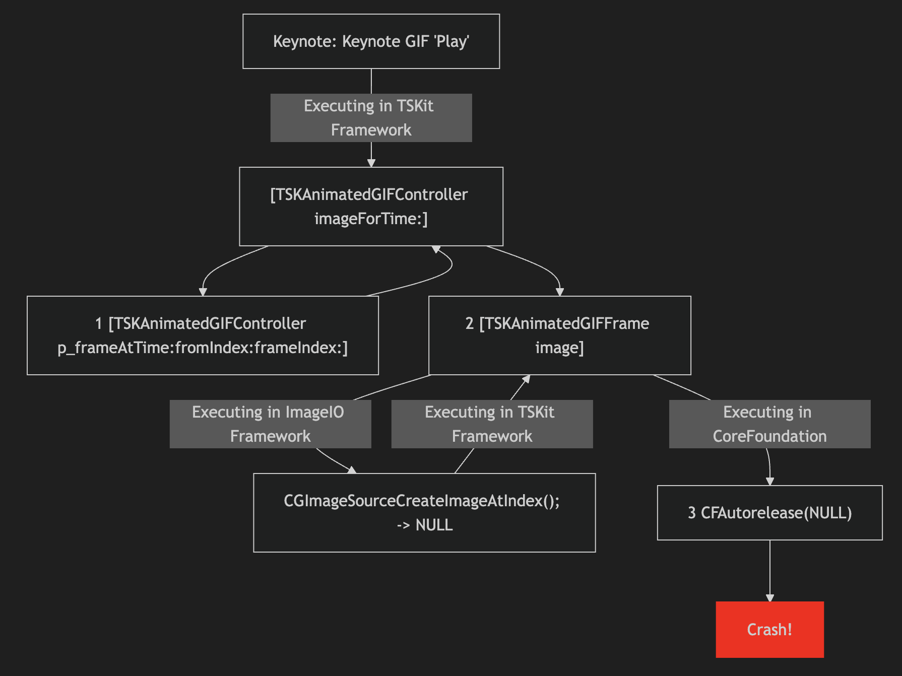
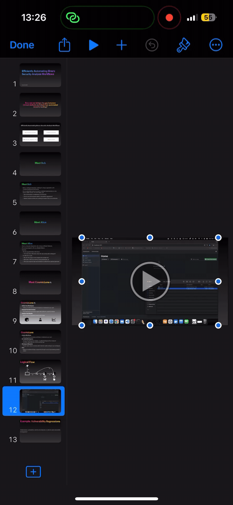
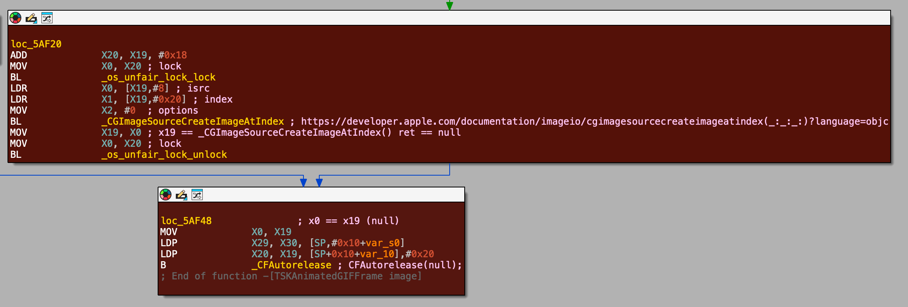

# Technical Analysis of DoS Condition in Apple's iOS/macOS iWork Suite

This document presents an analysis conducted in early 2025 of two interrelated logic bugs that lead to a Denial-of-Service (DoS) condition in the iWork Suite (Keynote, Pages, Numbers) on both macOS and iOS. The issues have been identified within the ImageIO (Bug 1) and TSKit (Bug 2) frameworks.

**Disclaimer:**  
This report is provided for educational purposes only, with responsible disclosure processes having been followed. The analysis is offered as-is, and any further publication or use of this information should adhere to responsible disclosure guidelines.



---

## Table of Contents

1. [Tested Hardware and Software](#tested-hardware-and-software)
2. [PoC](#crash-poc)
3. [Bug 1 – `CGImageSourceCreateImageAtIndex()` in ImageIO](#bug-1--cgimagesourcecreateimageatindex-in-imageio)
4. [Bug 2 – NULL `CFAutorelease()` Assert in TSKit](#bug-2--null-cfautorelease-assert-in-tskit)
5. [Remediation](#conclusion---remediation)
6. [References](#references)

---

## Tested Hardware and Software

| **Hardware**         | **OS Software**            | **iWork Software**                                                         |
|----------------------|----------------------------|----------------------------------------------------------------------------|
| MacBook Pro M1 2021  | macOS Sequoia 15.2 (24C101) | Keynote 14.3 (7042.0.76), Pages 14.3 (7042.0.76), Numbers 14.3 (7042.0.76)   |
| iPhone 15  | iOS 18.2.1 (22C161) | Keynote 14.3 (7371.0.72) |


---

## Crash PoC

The following proof-of-concept demonstrations illustrate the crash conditions observed on both the iOS and macOS platforms.

<div style="display: flex; justify-content: space-around; align-items: center;">
  <div style="text-align: center; margin: 10px;">
    <p><strong>iOS PoC</strong></p>
    
  </div>
  <div style="text-align: center; margin: 10px;">
    <p><strong>macOS PoC</strong></p>
    
  </div>
</div>

---

## 'Bug' 1 – Controlled Error-Case in `CGImageSourceCreateImageAtIndex()` (ImageIO)

When processing specific GIF inputs, the ImageIO framework's function `CGImageSourceCreateImageAtIndex()` returns NULL despite the GIF seemingly conforming to specification. Additional research may shed further light on why this error state occurs in ImageIO.

The following log entries illustrate the error:
```
2025-01-08 19:22:14.633788+0000 0xfef51    Error       0x0    22284  0  Keynote: (ImageIO) [com.apple.imageio:Keynote] initialize:411: malformed GIF frame#41 (3454 x 2222) - [canvasSize: 6856612  frameDataSize: 5355   adjustment: 1]
2025-01-08 19:22:14.633839+0000 0xfef51    Error       0x0    22284  0  Keynote: (ImageIO) [com.apple.imageio:Keynote] makeImagePlus:3737: *** ERROR: ’GIF ’-_reader->initImage[41] failed err=-50
2025-01-08 19:22:14.633858+0000 0xfef51    Error       0x0    22284  0  Keynote: (ImageIO) [com.apple.imageio:Keynote] createImageAtIndex:2093: *** ERROR: createImageAtIndex[41] - ’GIF ’ - failed to create image [-59]
2025-01-08 19:22:14.633870+0000 0xfef51    Error       0x0    22284  0  Keynote: (ImageIO) [com.apple.imageio:Keynote] CGImageSourceCreateImageAtIndex:5100: *** ERROR: CGImageSourceCreateImageAtIndex[41] - ’GIF ’ - failed to create image [-59]
```

According to Apple’s documentation, `CGImageSourceCreateImageAtIndex()` is expected to return a valid image or `NULL` if an error case. In this case, the 'bug' in ImageIO is benign as it returned in an expected and controlled manner, behaving as expected in the unexpected error-case. However, the returned `NULL` value is not handled correctly in the calling TSKit Framework code.

---

## Bug 2 – NULL `CFAutorelease()` Assert in TSKit

Bug 2 affects `TSKit.framework` when handling animated GIFs. The issue occurs in `-[TSKAnimatedGIFFrame image]`, where `CGImageSourceCreateImageAtIndex()` returns a `NULL` pointer that is passed to `CFAutorelease()` without validation, leading to a crash.

This happens because `CFAutorelease()` expects a valid Core Foundation object, as it adds the object to an autorelease pool for deferred deallocation. Since `NULL` isn't a valid Core Foundation object pointer, Core Foundation triggers an `assert()`, causing a controlled crash, rather than potentially creating a state that could possibly enable malicious memory corruption to occur.

The following call-graph highlights the faulty implementation:

<figure style="text-align: center;">
  
  <figcaption>Screenshot from IDA Pro (Hex-Rays) showing the TSKit Framework bug call-graph.</figcaption>
</figure>

In essence, the failure to verify the validity of the returned (assumed valid) CFImageRef before calling `CFAutorelease()` causes the crash.

## Conclusion / Remediation

I actually bumped into these issues by chance while prepping for a presentation and decided to debug the issues, and use it as an opportunity to practise conducting a root cause analysis of a bug and writing a triage report.

To avoid a situation where I mistook an exploitable issue for a non-exploitable issue, I submitted this report to the Apple Security Bounty program which confirmed there was no security impact associated with these bugs.

To resolve this issue, the developer of the TSKit framework should revise their implementation so as the return value of the call to `_CGImageSourceCreateImageAtIndex()` in `-[TSKAnimatedGIFFrame image]` should not assume a valid CFImageRef being returned, and should check the return value for `NULL` before calling `CFAutorelease()` on it.

```C
CFImageRef image = CGImageSourceCreateImageAtIndex(source, index, NULL);
if (!image) {
    // avoids error case - return early, log error, skip over the faulty frame?
} else {
    CFAutorelease(image); // where image is hopefully a valid object pointer :)
}
```

This write-up is an independent publication and has not been authorised, sponsored, or otherwise approved by Apple Inc. macOS, iOS, and iWork are trademarks of Apple Inc.

## References
- [Apple Developer Documentation: CGImageSourceCreateImageAtIndex()](https://developer.apple.com/documentation/imageio/cgimagesourcecreateimageatindex(_:_:_:)?language=objc)
- ChatGPT, OpenAI.